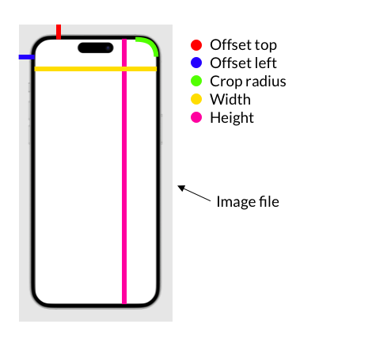

# Device Mock for Reprise

Device Mock for Reprise is a ServiceNow application that offers a simple way to capture mobile and in-device experiences as part of a [Reprise](https://www.getreprise.com) replay.

Reprise operates as a browser plugin, which captures experiences as they happen in a browser and saves them to be used as a part of a Reprise replay. The full HTML and CSS of an experience is captured by the browser plugin and saved so that it can be replayed.

One issue though is that not every demo happens in a web browser – some happen on a mobile device like an iPhone, iPad or Android device. This application allows you to easily take an in-device experience like this and replicate it inside your web browser, thus allowing you capture it using the Reprise browser plugin.

## Screenshots

|Screenshot| Description |
|---|---|
||The viewer with the control panel showing, and an area drawn onto the screenshot.|
||The viewer after pressing the escape key to hide the control panel interface, ready to be captured by the Reprise browser plugin.|
||The resultant capture in Reprise, with the area drawn over the Safari icon in the screenshot targetable with guides and links.|

## Features

- Support for devices found on the [Design at Meta Device Images](https://design.facebook.com/toolsandresources/devices/) page, such as phone, tablet, laptop, in various orientations e.g. portrait and landscape.
- Support for demo steps based on screenshots from an actual device, or simulated with an iFrame of an actual URL.
- Rectangular "demo areas" can be drawn onto screenshot-type demo steps to allow them to be used as targets for links or guides in the Reprise demo.

## Requirements
- Utah (or later) release of ServiceNow

## Installation

1. Download the latest update set XML release from the panel at the right of this page.
2. Load, preview, and commit the update set onto your instance.

## Configuration

### Creating a Demo

Demos are made up of Parts and Steps.

Demo Steps are the individual screens of a demo. Demo Parts allow you to group multiple Demo Steps together and make it easier to manage a large number of Demo Steps.

To create a demo, you need to first create a Demo Part. The only field you need to set is the Name of the Demo Part.

Once your Demo Part is created, a related list will appear on the form allowing you to define the Demo Steps for it. You can create as many Demo Steps as you want.

There are two types of Demo Steps:

- Screenshot – Useful for parts of the demo which are not reproducible in a web browser. For example, when you need to show the iOS home screen or something in the ServiceNow native mobile application.
- iFrame (URL) – Useful for part of the demo which are reproducible in a web browser. For example, when you need to show a Service Portal being opened on the mobile device.

It may not be fully clear why you would choose to use one type of Demo Step over the other. There is an important distinction to understand between these two though.

The screenshot type uses an image of the demo step to reproduce it in your browser. None of the HTML/CSS of the step is recreated in your browser. The iFrame (URL) type however actually reproduces the full HTML/CSS of the page inside your browser. This means that when the step is captured in Reprise, not only are the elements usable as with a normal Reprise capture (i.e. they can be targeted with guides and links) but it is also scrollable.

### Creating a Device
3 sample devices are availalbe out-of-box. An iPhone 12 Pro Max, and an iPad Pro in both landscape and portrait orientation.

You can create a new device based on any device downloadable from the Design at Meta Devices page:
https://design.facebook.com/toolsandresources/devices/

Simply open Meta Device Packages from the Application Navigator. Then, create a new record, give it a name, and upload the ZIP file for that device which you downloaded from the above URL.

NOTE: Ensure you downloaded the device-specific ZIP, not the ZIP that contains ALL devices!

After a few moments, the ZIP file will be extracted by an automated Flow and records will be automatically created in the Meta Devices related list.

The final step is to set the values for the fields in the "Positioning & Size" section of the form. The following diagram describes how to determine the value for each field. All values are in pixels.

You can either set these values manually, open the Viewer and through trial-and-error adjust until it's right. Or you can open one of the device images in a photo editing tool to get the precise measurements.

## Usage
Once you have your demo created, and the device you want to use loaded on your instance, it's time to capture your demo.

Open the Viewer from the Application Navigator and in the viewer use the Control Panel to select the correct Device and Demo Step.

### Max Width & Max Height

By default, the device will expand to fill the maximum space possible in the browser window, maintining its aspect ratio. You can use the Max Height and Max Width options to control the maximum that the device is allowed to expand in a particular direction. This is a particularly useful feature when an iFrame (URL) type Demo Step as even though the device expands, the content of the screen will not. Screenshot type Demo Steps are not affected by this issue, however if you have an iFrame (URL) type screen as part of your demo you might want to set so that the size of the device is consistent across all steps of your demo.

### Demo Areas
For Screenshot type Demo Steps, with the Control Panel visible you can draw "Demo Areas" onto the device screen. These will appear as red boxes dashed-red outline. You can create as many areas on a screen as necessary.

Demo Areas will have an X button in their top-right corner. You can press the X button to delete a Demo Area if you made a mistake.

When you press the Escape key to hide the Viewer interface, the Demo Areas will become hidden. However, they are still there, they are just invisible, and once captured by Reprise inside the replay editor these areas will become selectable. This will allow you to target them with Links & Guides.

### Capturing
You can press the Escape key on your keyboard to hide all UI elements and use the Reprise browser plugin to capture the browser tab.

To capture the next Demo Step you can either press the Escape key again and use the Control panel to change it, or use the Left/Right keys on your keyboard to go Back/Forward through the Demo Steps for the selected Demo Part.

## Related Repositories

- [dylanlindgren/device-mock-for-reprise-components](https://github.com/dylanlindgren/device-mock-for-reprise-components)
- [dylanlindgren/device-mock-for-reprise-global](https://github.com/dylanlindgren/device-mock-for-reprise-global)