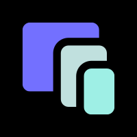
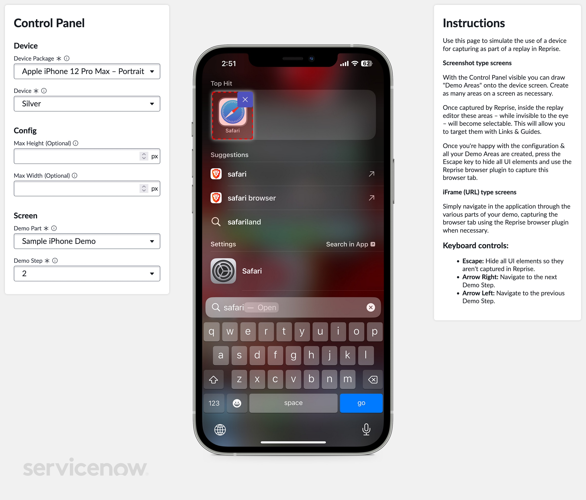
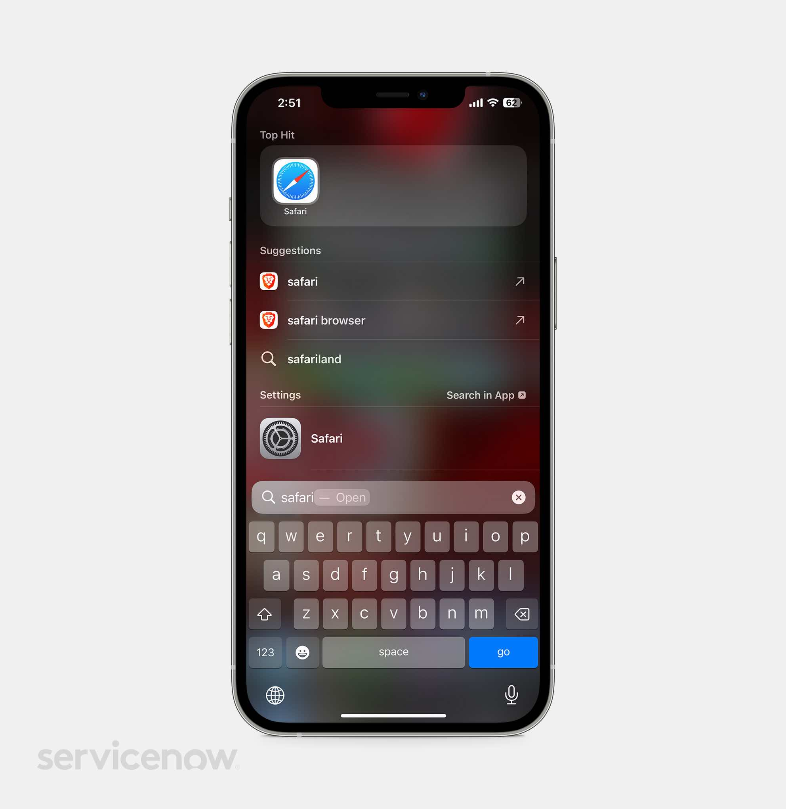
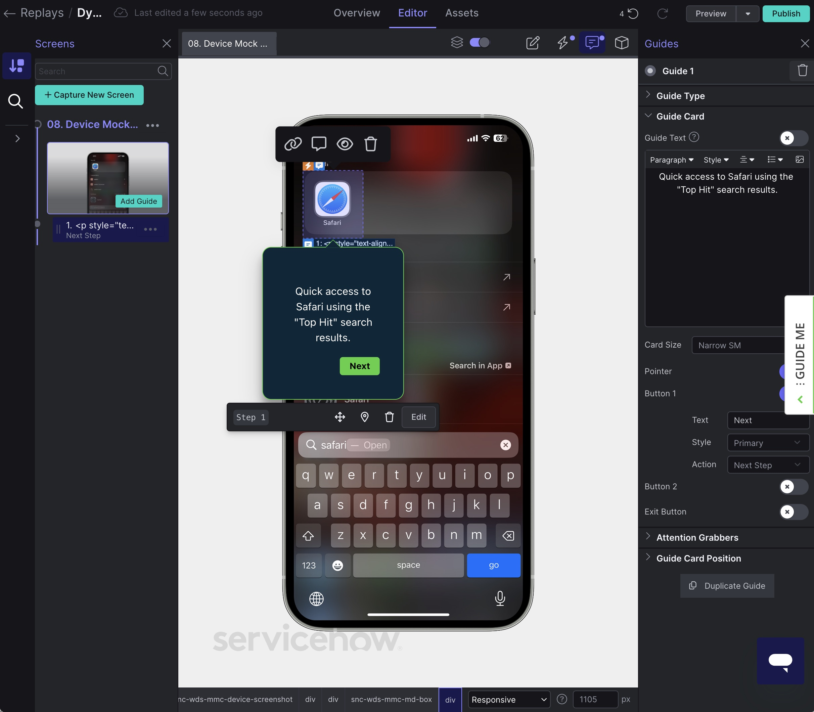

# Device Mock for Reprise

Device Mock for Reprise is a ServiceNow application that offers a simple way to capture mobile and in-device experiences as part of a [Reprise](https://www.getreprise.com) replay.

Reprise operates as a browser plugin, which captures experiences as they happen in a browser and saves them to be used as a part of a Reprise replay. The full HTML and CSS of an experience is captured by the browser plugin and saved so that it can be replayed.

One issue though is that not every demo happens in a web browser – some happen on a mobile device like an iPhone, iPad or Android device. This application allows you to easily take an in-device experience like this and replicate it inside your web browser, thus allowing you capture it using the Reprise browser plugin.

## Screenshots

|Screenshot| Description |
|---|---|
||The viewer with the control panel showing, and an area drawn onto the screenshot.|
||The viewer after pressing the escape key to hide the control panel interface, ready to be captured by the Reprise browser plugin.|
||The resultant capture in Reprise, with the area drawn over the Safari icon in the screenshot targetable with guides and links.|

## Features

- Support for many device types, such as phone, tablet, laptop, all in various orientations (e.g. portrait, landscape) available for download free from the [Design at Meta Device Images](https://design.facebook.com/toolsandresources/devices/) page.
- Define demo steps and group them into demo parts.
- Support for demo parts based on screenshots from an actual device presented in a device frame, or simulated with an iFrame appearing inside a device frame.
- Demo areas can be drawn onto screenshots to allow those demo areas to be used as targets for links or guides in the Reprise demo.

## Installation

Download the latest release from the panel at the right of this page.

## Usage

Instructions coming soon.